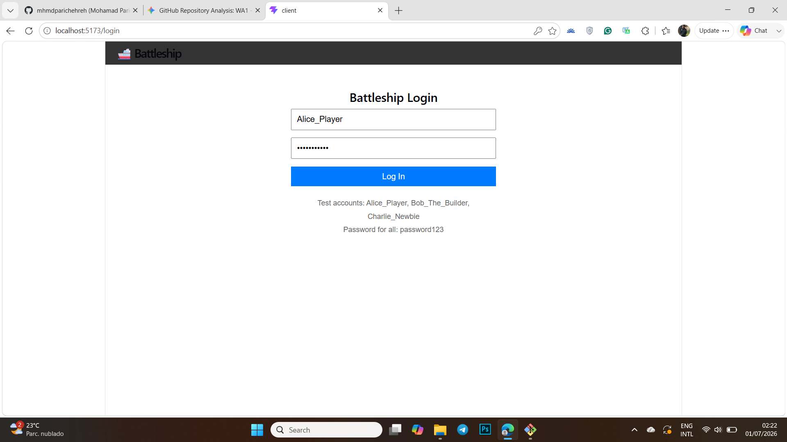
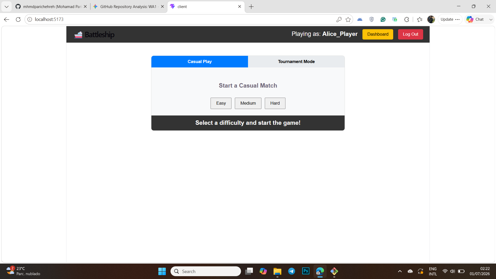
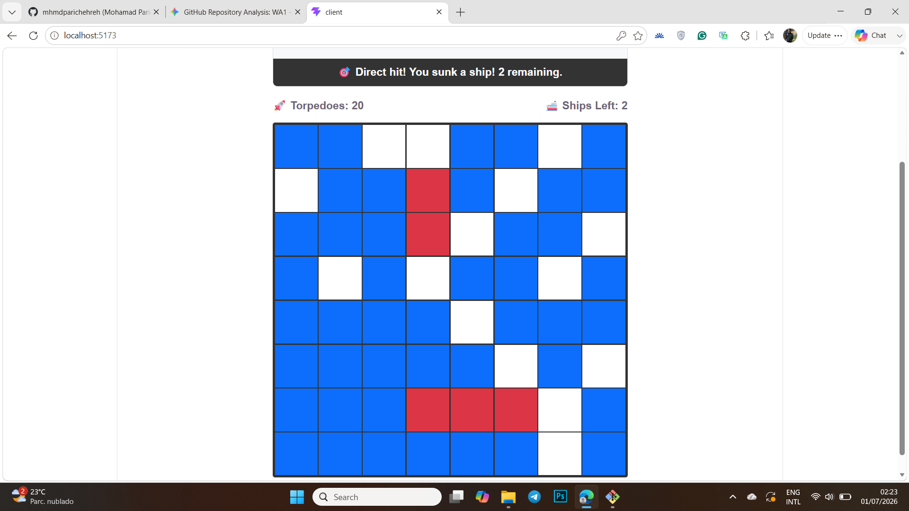
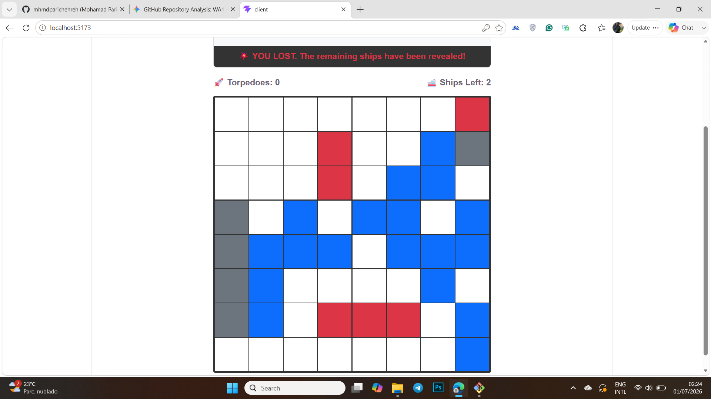
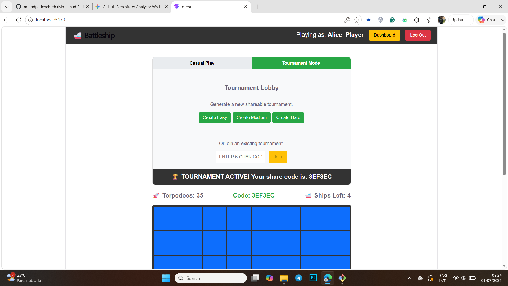
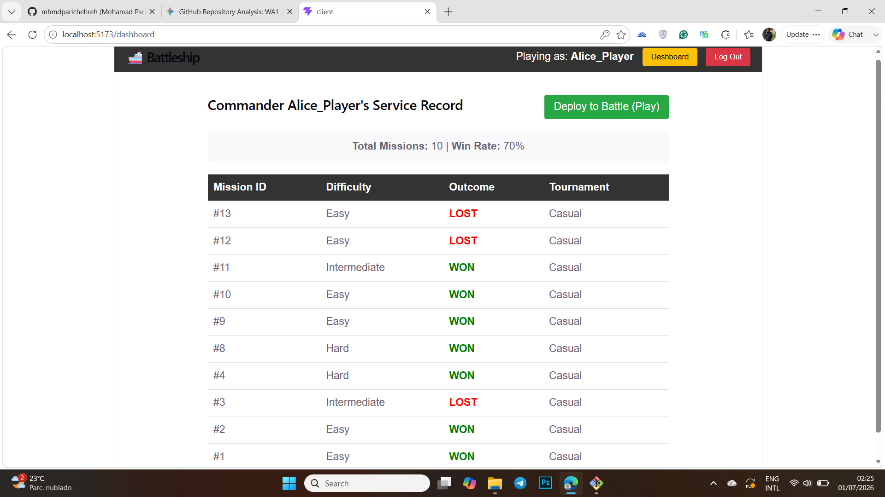

# Exam #2: "Battleship"
## Student: s328173 MOHAMAD PARICHEHREHTEROUJENI 

## React Client Application Routes

- Route `/`: The main Game Board page. Allows authenticated users to play Casual or Tournament mode Battleship on interactive grids.
- Route `/login`: The authentication page where users enter their credentials to start a session.
- Route `/dashboard`: The player service record page, displaying a table of the user's past match history, tournament codes, and overall win rate.

## API Server

- POST `/api/sessions`
  - Request body: `{ "username": "Alice_Player", "password": "password123" }`
  - Response body: `{ "id": 1, "username": "Alice_Player" }`
- GET `/api/sessions/current`
  - Request parameters: None (relies on session cookie)
  - Response body: `{ "id": 1, "username": "Alice_Player" }`
- DELETE `/api/sessions/current`
  - Request parameters: None
  - Response body: Empty (Status 200 OK)
- POST `/api/matches`
  - Request body: `{ "difficulty": "Easy", "mode": "casual", "tournamentCode": null }`
  - Response body: `{ "gameId": "uuid-string", "gridSize": 8, "torpedoes": 35, "totalShips": 4, "shipSizes": [4, 3, 2, 2], "tournamentCode": null }`
- POST `/api/matches/:id/torpedo`
  - Request parameters: `:id` (The UUID of the active game)
  - Request body: `{ "row": 0, "col": 0 }`
  - Response body: `{ "result": "water|hit|hit and sunk", "torpedoes": 34, "shipsRemaining": 4, "gameOver": false, "outcome": null, "finalPositions": null }` (finalPositions is populated only if gameOver is true)
- GET `/api/matches/history`
  - Request parameters: None (uses session ID)
  - Response body: Array of objects `[{ "id": 1, "user_id": 1, "difficulty": "Easy", "outcome": "won", "tournament_code": null }]`

## Database Tables

- Table `users` - contains `id` (Primary Key), `username`, `password` (hashed), `salt`
- Table `matches` - contains `id` (Primary Key), `user_id` (Foreign Key), `difficulty`, `outcome` (won/lost), `tournament_code` (nullable)

## Main React Components

- `App` (in `App.jsx`): Main router component that manages the global `loggedInUser` state and protects routes.
- `Login` (in `Login.jsx`): Handles user authentication, credential submission, and error display.
- `Navbar` (in `Navbar.jsx`): Persistent top navigation bar displaying the current user, a link to the dashboard, and a logout button.
- `GameBoard` (in `GameBoard.jsx`): The core interactive component. Handles the grid rendering, click events, game logic state, and the Tournament/Casual lobby interface.
- `Dashboard` (in `Dashboard.jsx`): Fetches and displays the user's match history from the database in a formatted table, calculating their overall win rate.

## Screenshot

## Users Credentials

- Alice_Player, password123
- Bob_The_Builder, password123
- Charlie_Newbie, password123

## Use of AI Tools
During the development of this project, I used an AI assistant (Google Gemini) as an expert guide and collaborative tool. It assisted with debugging (e.g., identifying a Vite JSX parsing error), structuring the Battleship game engine math (validating ship placement bounds), and implementing the layout of React components. I verified all generated code by manually testing the application flow, checking server logs, and ensuring it met the specific constraints of the exam requirements before committing.
